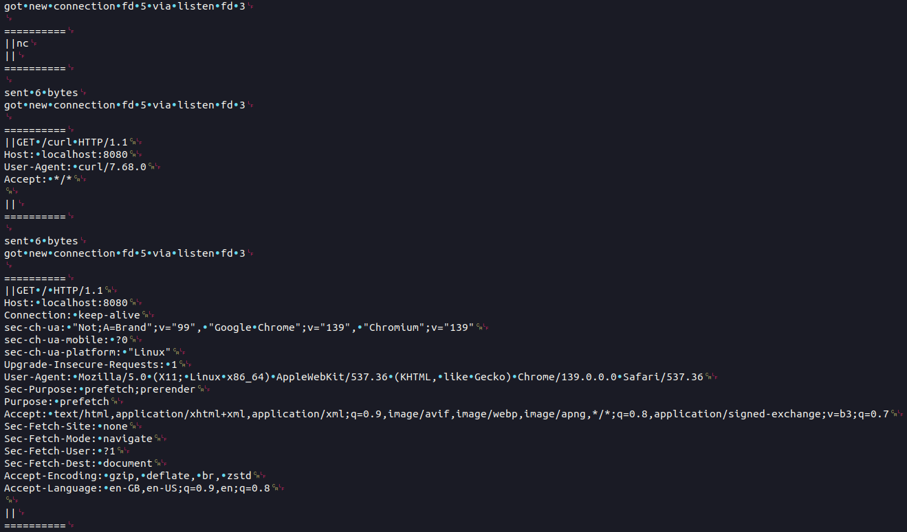

# unsafehttp

*Extremely* minimal HTTP server written in C from scratch, to practice C, \*nix
socket programming, C compilation.

## HTTP implementation

RFC 9112 is a fantastic document that details the exact format of HTTP 1.1
requests, how servers should respond to those requests, and is even written in a
way that would make implementing a full test suite a reasonable task.

This server follows almost none of that.

In the interest of keeping this a fun and short side project, I've implemented
the very bare minimum for browsers to be able to send a simple HTTP GET request
to the server, and receive a response that lets them render a webpage. Again in
the interest of keeping this short, I'm not even following the RFC exactly.
Readers MUST NOT hold this against the project, and SHOULD use this as
motivation to keep some of their own side projects fun and short.

## Building

Prereqs: standard gcc/buildtools things.

Builds output to `build/`.

### Dev / testing

Has ASAN and other debugging/testing options enabled.

```sh
make build-dev
```

### Release / production

```sh
make build-rel
```

## Running

Builds and runs the dev version.

```sh
make run
# or to pass args
make run ARGS="args here passed to unsafehttp"
```

## Viewing HTTP request formats

If you use `print_buffer()` on received data, you can get a good overview of
request structures using

```sh
make run | batcat --show-all --pager=never
```

Here are some examples when connecting with netcat, curl and Chrome:

.